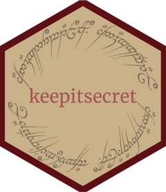

<!-- README.md is generated from README.Rmd. Please edit that file -->

```{r, include = FALSE}
knitr::opts_chunk$set(
  collapse = TRUE,
  comment = "#>",
  fig.path = "man/figures/README-",
  out.width = "100%"
)
```

# keepitsecret 

<!-- badges: start -->
<!-- badges: end -->

:warning: **Early development**

This package will help you generate a strong password. Even better, the password
will contain words straight out of the Lord of the Rings novel!

## Installation

You can install the development version of keepitsecret like so:

``` r
devtools::install_github("bbartholdy/keepitsecret")
```

## Examples

To generate a password.

```{r generate}
library(keepitsecret)
pw <- keepitsafe()
pw
```

You can also test whether a password has been part of a data breach (is it secret?)

```{r secret}
is_it_secret(pw)
```

and how strong is your password (is it safe?)

```{r safe}
is_it_safe(pw)
```

Beware of common

```{r leaked}
is_it_secret("password1234")
```

and weak passwords!

```{r weak}
is_it_safe("password1234")
```


