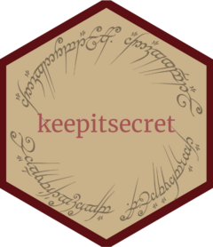

<!-- README.md is generated from README.Rmd. Please edit that file -->

# keepitsecret 

<!-- badges: start -->
<!-- badges: end -->

:warning: **Early development**

This package will help you generate a strong password. Even better, the
password will contain words straight out of the Lord of the Rings novel!

## Installation

You can install the development version of keepitsecret like so:

``` r
devtools::install_github("bbartholdy/keepitsecret")
```

## Example

To generate a password.

``` r
library(keepitsecret)
pw <- keepitsafe()
pw
#> [1] "coasts stalking prove forked"
```

You can also test whether a password has been part of a data breach (is
it secret?)

``` r
is_it_secret(pw)
#> ✔ All right, cousin Frodo! You can keep your secret for the present, if you want to be mysterious.
```

and how strong is your password (is it safe?)

``` r
is_it_safe(pw)
#> This password takes centuries to crack at 10 guesses per second.
#> ✔ You cannot pass. The dark fire will not avail you, flame of Udtn. Go back to the Shadow! You cannot pass. You cannot pass!
```
